# Secure File Share Project

A comprehensive solution for sharing, viewing, and downloading files securely. This project includes a React-based frontend and a Django-based backend, leveraging Docker for containerization and deployment.

---

## Features
- **Secure File Sharing**: Upload, share, and access files securely with authentication and authorization.
- **Preview Functionality**: View supported file types (images, PDFs, videos) inline without downloading.
- **Download Option**: Download files securely with proper permissions.
- **User-Friendly UI**: React-based frontend for a seamless user experience.

---

## Prerequisites
Ensure you have the following installed on your system:

- Docker and Docker Compose
- Python (3.8 or higher)
- Node.js (16.x or higher) and npm
- OpenSSL (for generating SSL certificates)
- Authenticator APP ( eg, Authy )
- Gmail app ( For App Password )

---

## Setup Instructions

### 1. Clone the Repository
Clone the project repository to your local machine:
```bash
git clone <repository-url>
cd secured-file-share
```

### 2. Backend Setup

#### a. Create a Virtual Environment (Optional)
```bash
python3 -m venv venv
source venv/bin/activate  # On Windows, use `venv\Scripts\activate`
```

#### b. Install Dependencies
Install the required Python packages:
```bash
pip install -r requirements.txt
```

#### c. Apply Migrations
Run database migrations:
```bash
python manage.py migrate
```

#### d. Create a Superuser
Create an admin user for managing the application:
```bash
python manage.py createsuperuser
```

#### e. Run the Development Server
Start the backend server:
```bash
python manage.py runserver_plus --cert-file certificates/devserver.crt --key-file certificates/devserver.key
```

### 3. Frontend Setup

#### a. Navigate to the Frontend Directory
```bash
cd frontend
```

#### b. Install Dependencies
Install the required Node.js packages:
```bash
npm install
```

#### c. Start the Frontend Development Server
Start the React app:
```bash
npm start
```

### 4. Dockerized Setup

#### a. Build and Start Containers
Run the application using Docker Compose:
```bash
docker-compose up --build
```

Run tests:
```
docker-compose run --rm backend sh -c "python manage.py test"
```

#### b. Access the Application
- Frontend: [https://127.0.0.1:5173/](https://127.0.0.1:5173/)
- Backend: [https://127.0.0.1:8000/](https://127.0.0.1:8000/)

---

## Configuration

### Environment Variables
Configure the following environment variables in a `.env` file:

```env
For Email functionality create gmail account and app password
[How to create app password](https://www.youtube.com/watch?v=lSURGX0JHbA&t=5s)

File location -> backend/backend/

EMAIL_HOST_USER=EMAIL_HOST_USER 
EMAIL_HOST_PASSWORD=EMAIL_HOST_PASSWORD
MASTER_KEY=MASTER_KEY
SECRET_KEY =SECRET_KEY
```

### CSRF Trusted Origins
Ensure the `CSRF_TRUSTED_ORIGINS` setting in `backend/settings.py` includes:
```python
CSRF_TRUSTED_ORIGINS = [
    'https://localhost',
    'https://127.0.0.1',
    # Add your public IP or domain here
]
```

---

## File Types Supported for Preview
The following file types are supported for inline preview:
- Images: PNG, JPEG, JPG
- Videos: MP4
- Documents: PDF

---

## Testing

### Backend Tests
Run backend test cases:
```bash
python manage.py test
```

---


### App Steps

### User Registration and Authentication
1. **Register User**: Create a new account using the registration form.
   - 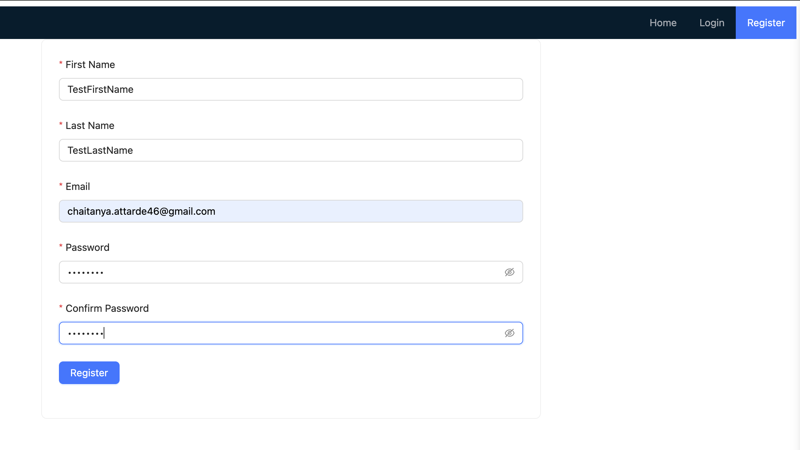
   - 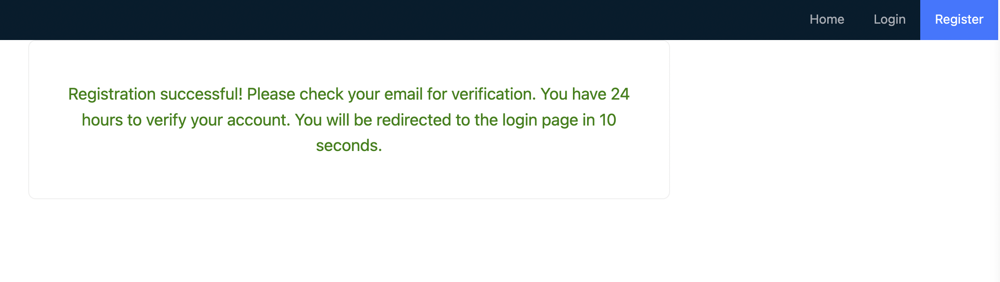
   - 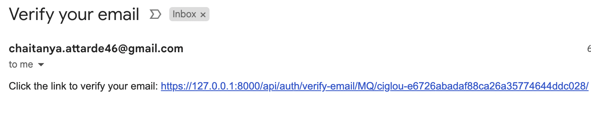

2. **Activate Account (For localhost)**: Open the link received in the email in the same browser or machine.
   - 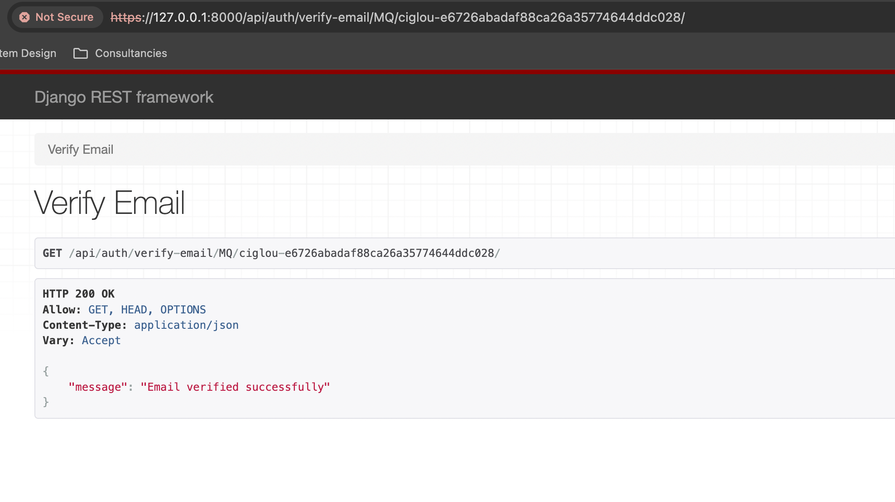

3. **Login**: Enter your username and password to log in.
   - 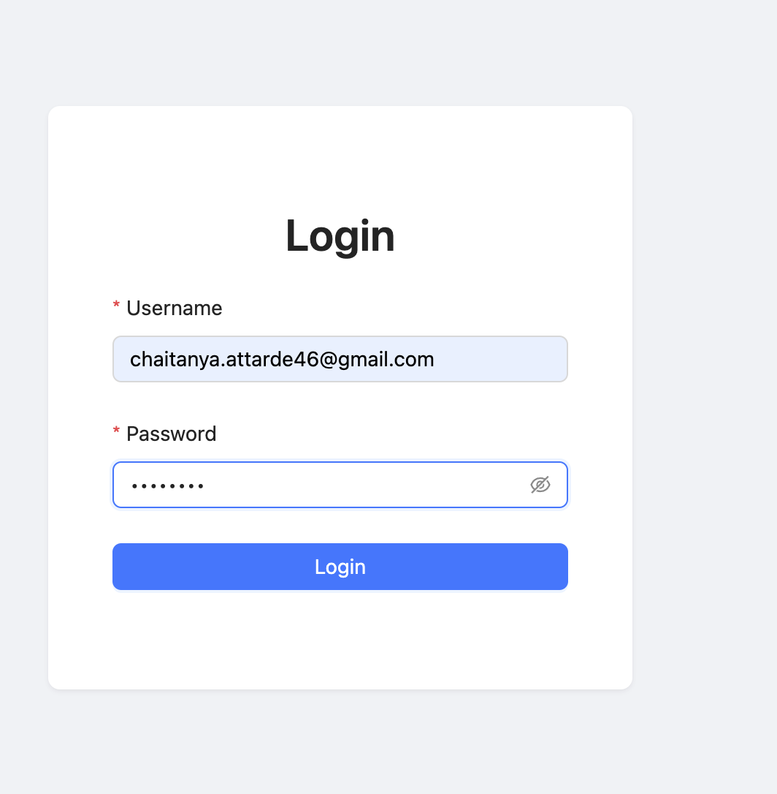

4. **MFA Setup**:
   - On first login, you will receive an MFA QR code.
   - Scan the QR code using an app like Authy.
   - Enter the first OTP to activate MFA. Without this step, the user cannot log in.
   - 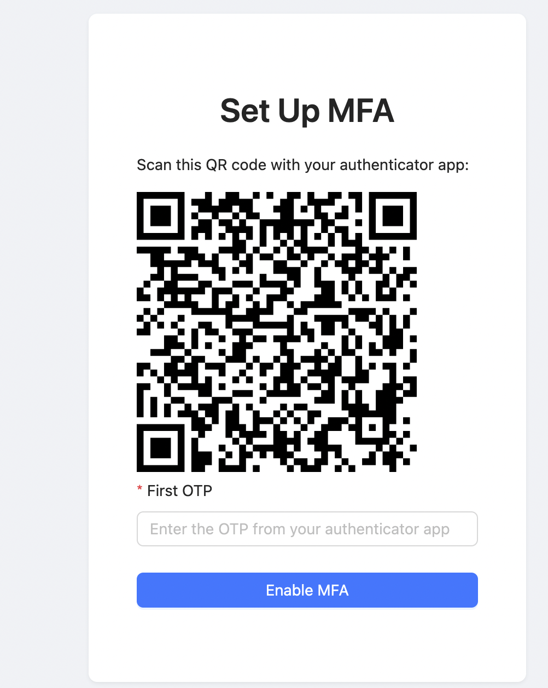

5. **Login with OTP**:
   - Once the username and password are verified, enter the OTP to successfully log in.
   - 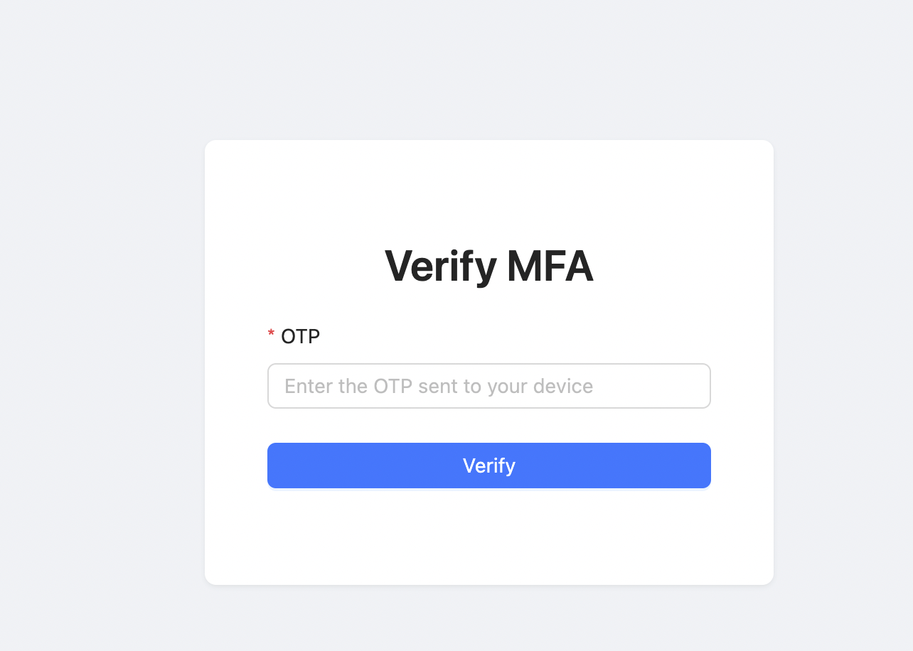

### File Management

1. **Upload Files/Download Files**:
   - Upload files securely to the system.
   - 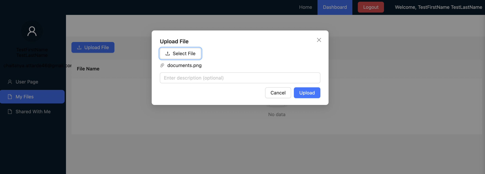

2. **Share Files with Other Users**:
   - Share files securely with specific users.
   - 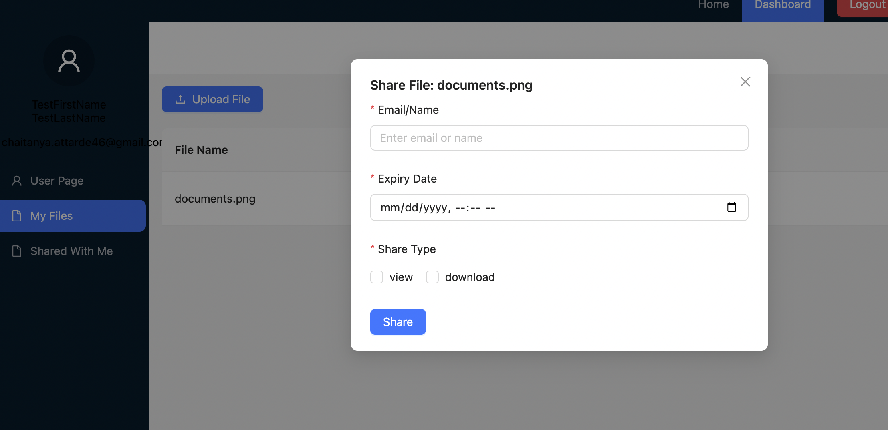

3. **Share Files Publicly**:
   - Share files via public links (email send option included).
   - An email will be sent containing the access link.
   - 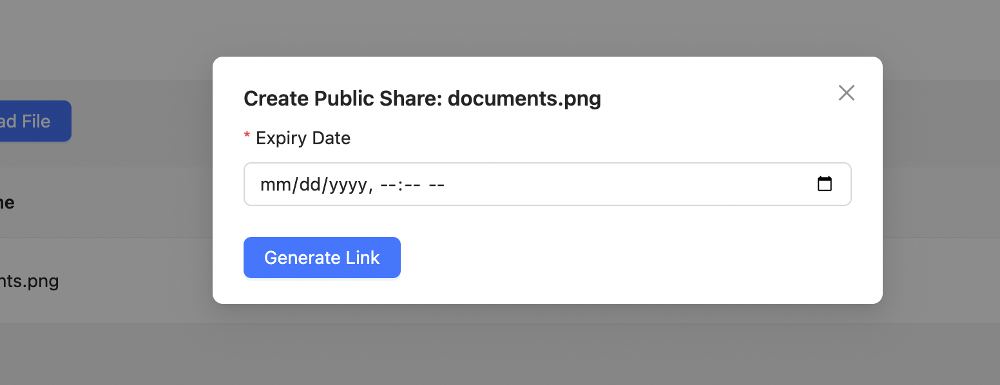
   - 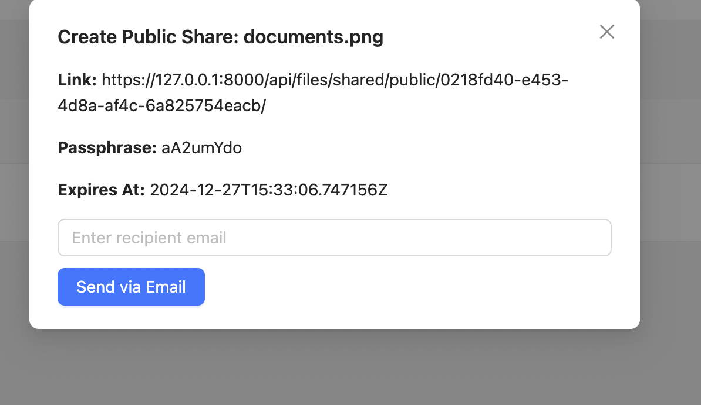

4. **View Files**:
   - View supported file types (e.g., PDFs, images) inline.
   - 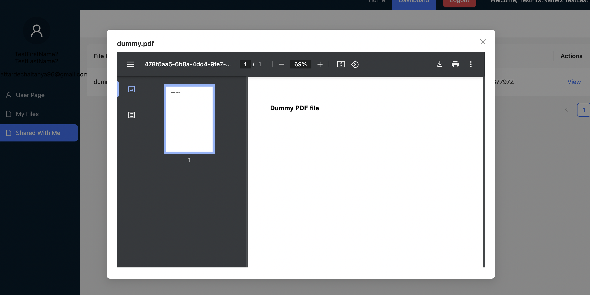

5. **View Files Shared With Me**
   - View files others shared with me
   - 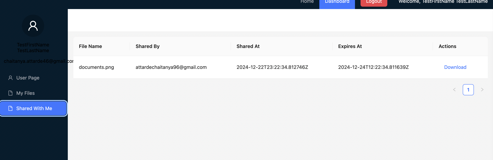

### Security
- Each file is encrypted at rest and decrypted when accessed.


## Troubleshooting

- **Frontend not connecting to the backend**: Check CORS settings and ensure `CSRF_TRUSTED_ORIGINS` includes the frontend URL.
- **Docker build errors**: Ensure dependencies are installed and the Docker daemon is running.

---

## License
This project is licensed under the MIT License. See the [LICENSE](LICENSE) file for details.

---

## Contributing
Feel free to fork the repository and submit pull requests. Contributions are welcome!

---

## Contact
For issues or inquiries, contact the project maintainer at [chaitanya.attarde46@gmail.com].

